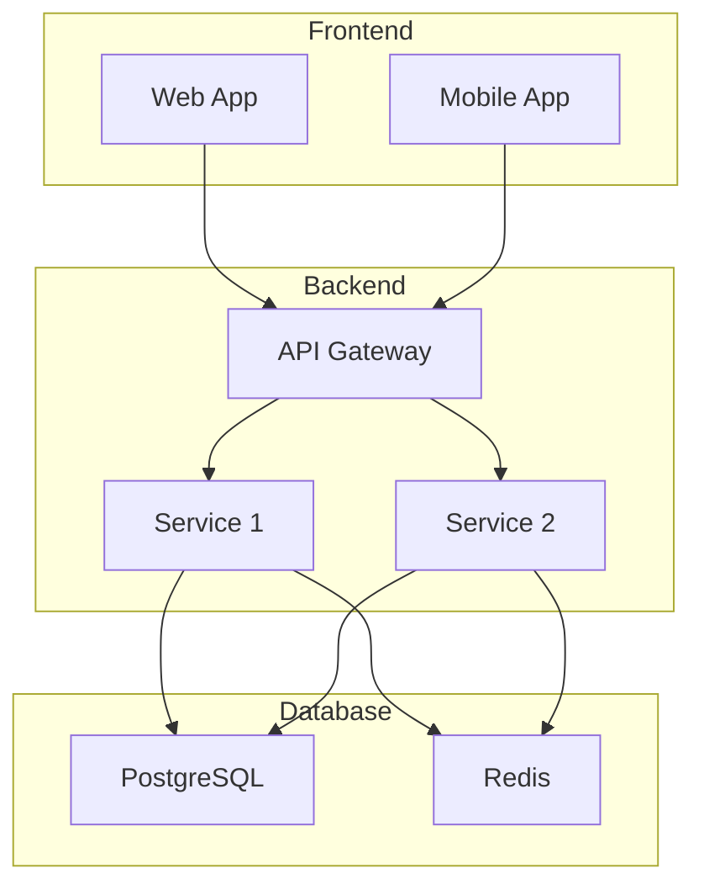
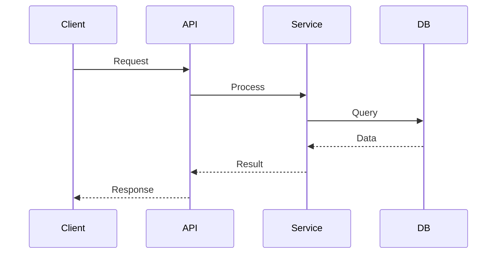
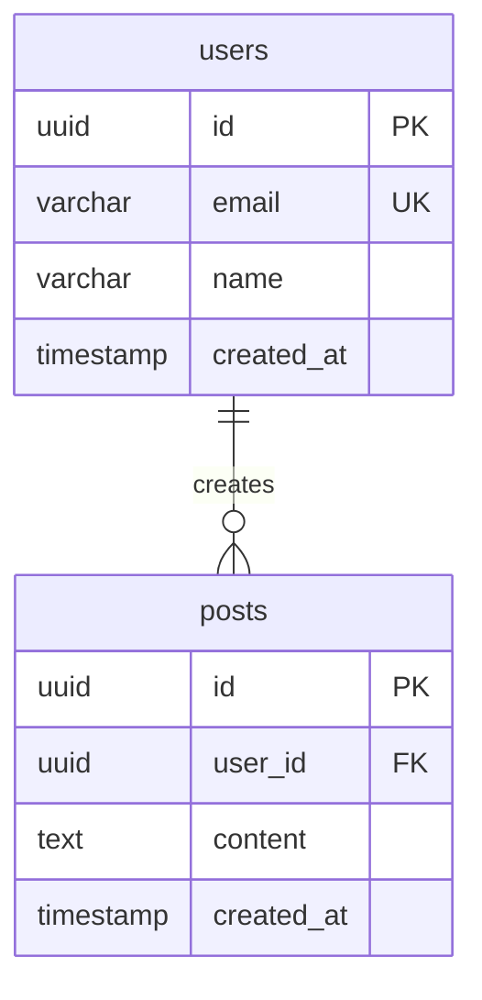
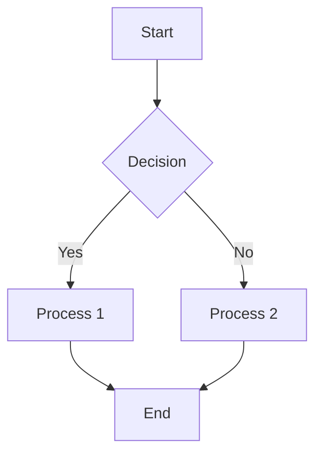

# 📚 Инструкция: Создание HTML документации с Mermaid диаграммами

## 🎯 Обзор

Эта инструкция поможет вам создать профессиональную HTML документацию с интерактивными Mermaid диаграммами, как в проекте Personal Health OS. Документация будет включать:
- Интерактивные диаграммы архитектуры
- Табовый интерфейс для навигации
- Масштабирование диаграмм
- Адаптивный дизайн
- Современный UI

---

## 🛠️ Технологический стек

- **Mermaid.js 10.6.1** - для создания диаграмм
- **HTML5/CSS3** - основа документа
- **Vanilla JavaScript** - интерактивность
- **CSS Grid/Flexbox** - адаптивная верстка
- **CSS Variables** - кастомизация тем

---

## 📁 Структура проекта

```
project-docs/
├── index.html                 # Основной файл документации
├── mermaid-height-util.js     # Утилита для масштабирования
├── styles/
│   └── documentation.css      # Стили (опционально)
├── assets/
│   └── images/               # Изображения и иконки
└── README.md                 # Этот файл
```

---

## 🚀 Быстрый старт

### 1. Создание основного HTML файла

```html
<!DOCTYPE html>
<html lang="en">
<head>
    <meta charset="UTF-8">
    <meta name="viewport" content="width=device-width, initial-scale=1.0">
    <title>Project Documentation</title>
    
    <!-- External resources -->
    <script src="https://cdn.jsdelivr.net/npm/mermaid@10.6.1/dist/mermaid.min.js"></script>
    <script src="mermaid-height-util.js"></script>
    
    <!-- Styles -->
    <style>
        /* Стили будут добавлены ниже */
    </style>
</head>
<body>
    <!-- Контент документации -->
    <script>
        // JavaScript для инициализации
    </script>
</body>
</html>
```

### 2. Создание утилиты масштабирования

Создайте файл `mermaid-height-util.js`:

```javascript
class MermaidHeightAdjuster {
    constructor() {
        this.currentScale = 1.0;
        this.minScale = 0.5;
        this.maxScale = 2.0;
        this.init();
    }

    init() {
        this.setupTabSwitching();
        this.setupScaleControls();
        this.adjustAllDiagrams();
    }

    setupTabSwitching() {
        const tabs = document.querySelectorAll('.nav-tab');
        tabs.forEach(tab => {
            tab.addEventListener('click', (e) => this.showTab(e));
        });
    }

    setupScaleControls() {
        document.addEventListener('click', (e) => {
            if (e.target.matches('.scale-btn[data-scale-delta]')) {
                this.changeScale(parseFloat(e.target.dataset.scaleDelta));
            } else if (e.target.matches('.scale-btn[data-reset-scale]')) {
                this.resetScale();
            }
        });
    }

    showTab(event) {
        const tabName = event.currentTarget.dataset.tab;
        
        // Hide all tabs
        document.querySelectorAll('.tab-pane').forEach(tab => {
            tab.classList.remove('active');
        });
        
        // Remove active class from buttons
        document.querySelectorAll('.nav-tab').forEach(btn => {
            btn.classList.remove('active');
        });
        
        // Show selected tab
        const targetTab = document.getElementById(tabName);
        if (targetTab) {
            targetTab.classList.add('active');
            this.adjustDiagramsInTab(targetTab);
        }
        
        // Activate button
        event.currentTarget.classList.add('active');
    }

    changeScale(delta) {
        this.currentScale = Math.max(this.minScale, 
            Math.min(this.maxScale, this.currentScale + delta));
        this.updateScaleDisplay();
        this.adjustAllDiagrams();
    }

    resetScale() {
        this.currentScale = 1.0;
        this.updateScaleDisplay();
        this.adjustAllDiagrams();
    }

    updateScaleDisplay() {
        const displays = document.querySelectorAll('.scale-display');
        displays.forEach(display => {
            display.textContent = Math.round(this.currentScale * 100) + '%';
        });
    }

    adjustDiagramsInTab(tab) {
        const containers = tab.querySelectorAll('.diagram-container');
        containers.forEach(container => this.adjustDiagram(container));
    }

    adjustAllDiagrams() {
        const containers = document.querySelectorAll('.diagram-container');
        containers.forEach(container => this.adjustDiagram(container));
    }

    adjustDiagram(container) {
        const svg = container.querySelector('svg');
        if (!svg) return;

        const bbox = svg.getBBox();
        const padding = 40;
        const scaledHeight = (bbox.height + padding) * this.currentScale;
        const scaledWidth = (bbox.width + padding) * this.currentScale;
        
        // Apply scaling
        svg.style.transform = `scale(${this.currentScale})`;
        svg.style.transformOrigin = 'center';
        
        // Update container height
        container.style.height = scaledHeight + 'px';
        container.style.width = '100%';
    }
}

// Initialize when DOM is ready
document.addEventListener('DOMContentLoaded', () => {
    window.mermaidHeightAdjuster = new MermaidHeightAdjuster();
});
```

---

## 🎨 CSS стили

### Базовые стили для документации

```css
/* Reset and base styles */
* {
    margin: 0;
    padding: 0;
    box-sizing: border-box;
}

body {
    font-family: -apple-system, BlinkMacSystemFont, 'Segoe UI', Roboto, sans-serif;
    background: linear-gradient(135deg, #667eea 0%, #764ba2 100%);
    min-height: 100vh;
    color: #333;
}

.container {
    max-width: 1400px;
    margin: 0 auto;
    padding: 20px;
    background: rgba(255, 255, 255, 0.95);
    border-radius: 15px;
    box-shadow: 0 20px 40px rgba(0, 0, 0, 0.1);
    backdrop-filter: blur(10px);
}

/* Header styles */
.header {
    text-align: center;
    margin-bottom: 20px;
    padding: 20px 0;
}

.header h1 {
    font-size: 2.5rem;
    font-weight: 700;
    margin-bottom: 10px;
    background: linear-gradient(45deg, #667eea, #764ba2);
    -webkit-background-clip: text;
    -webkit-text-fill-color: transparent;
    background-clip: text;
    color: transparent;
}

.header p {
    font-size: 1.1rem;
    color: #666;
    font-weight: 500;
}

/* Navigation tabs */
.nav-tabs {
    display: flex;
    background: rgba(255, 255, 255, 0.1);
    border-radius: 10px;
    padding: 5px;
    margin-bottom: 20px;
    gap: 2px;
    flex-wrap: wrap;
}

.nav-tab {
    background: rgba(255, 255, 255, 0.2);
    color: #333;
    border: none;
    padding: 10px 20px;
    border-radius: 8px;
    cursor: pointer;
    font-size: 0.9rem;
    font-weight: 600;
    transition: all 0.3s ease;
    margin-right: 2px;
}

.nav-tab:hover {
    background: rgba(255, 255, 255, 0.3);
    transform: translateY(-2px);
}

.nav-tab.active {
    background: linear-gradient(45deg, #667eea, #764ba2);
    color: white;
    transform: translateY(-2px);
    box-shadow: 0 4px 12px rgba(102, 126, 234, 0.3);
}

/* Content area */
.content {
    padding: 20px;
    border-radius: 10px;
    background: rgba(255, 255, 255, 0.98);
}

.tab-pane {
    display: none;
    animation: fadeIn 0.5s ease-in-out;
}

.tab-pane.active {
    display: block;
}

.tab-pane h2 {
    color: #333;
    margin-bottom: 20px;
    font-size: 1.8rem;
    font-weight: 600;
}

/* Diagram container */
.diagram-container {
    position: relative;
    margin: 20px 0;
    background: #f8f9fa;
    border-radius: 8px;
    border: 1px solid #e9ecef;
    transition: all 0.2s ease;
    overflow: visible;
}

.mermaid-wrapper {
    display: flex;
    justify-content: center;
    padding: 20px;
    transition: all 0.2s ease;
}

.mermaid {
    background: transparent;
    display: inline-block;
    width: auto !important;
}

.mermaid svg {
    max-width: 100%;
    height: auto !important;
    display: block;
    margin: 0 auto;
}

/* Scale controls */
.scale-controls {
    position: absolute;
    top: 10px;
    right: 10px;
    background: rgba(102, 126, 234, 0.95);
    border-radius: 20px;
    padding: 6px 10px;
    display: flex;
    align-items: center;
    gap: 8px;
    z-index: 100;
    backdrop-filter: blur(8px);
    box-shadow: 0 2px 8px rgba(0,0,0,0.15);
}

.scale-btn {
    background: rgba(255, 255, 255, 0.25);
    color: white;
    border: none;
    padding: 4px 10px;
    border-radius: 16px;
    cursor: pointer;
    font-size: 12px;
    font-weight: bold;
    transition: all 0.2s ease;
}

.scale-btn:hover {
    background: rgba(255, 255, 255, 0.4);
    transform: scale(1.05);
}

.scale-display {
    color: white;
    font-size: 12px;
    font-weight: bold;
    min-width: 45px;
    text-align: center;
    background: rgba(0,0,0,0.3);
    padding: 2px 8px;
    border-radius: 20px;
}

/* Service cards grid */
.service-grid {
    display: grid;
    grid-template-columns: repeat(auto-fit, minmax(300px, 1fr));
    gap: 20px;
    margin-top: 20px;
}

.service-card {
    background: rgba(255, 255, 255, 0.15);
    padding: 20px;
    border-radius: 10px;
    border: 1px solid #e9ecef;
    transition: all 0.3s ease;
}

.service-card:hover {
    transform: translateY(-5px);
    box-shadow: 0 10px 25px rgba(0, 0, 0, 0.1);
}

.service-card h3 {
    color: #333;
    margin-bottom: 10px;
    font-size: 1.2rem;
    font-weight: 600;
}

.service-card p {
    color: #666;
    margin-bottom: 15px;
    line-height: 1.6;
}

.tech-stack {
    background: rgba(255,255,255,0.15);
    padding: 15px;
    border-radius: 10px;
    margin-top: 10px;
}

.tech-stack h4 {
    margin-bottom: 10px;
    font-size: 0.9rem;
}

.tech-stack ul {
    list-style: none;
    font-size: 0.8rem;
}

.tech-stack li {
    padding: 3px 0;
    border-bottom: 1px solid rgba(0,0,0,0.1);
}

/* Animations */
@keyframes fadeIn {
    from { opacity: 0; }
    to { opacity: 1; }
}

/* Responsive design */
@media (max-width: 768px) {
    .container { padding: 10px; }
    .header h1 { font-size: 2rem; }
    .content { padding: 15px; }
    .nav-tabs { justify-content: flex-start; overflow-x: auto; }
    .scale-controls { top: 5px; right: 5px; padding: 3px 6px; gap: 4px; }
    .scale-btn { padding: 2px 6px; font-size: 10px; }
    .scale-display { font-size: 10px; min-width: 35px; }
    .service-grid { grid-template-columns: 1fr; }
}
```

---

## 📊 Создание Mermaid диаграмм

### Типы диаграмм

#### 1. Граф архитектуры (graph)


#### 2. Последовательность (sequence)


#### 3. ER диаграмма (erDiagram)


#### 4. Граф потока (flowchart)


---

## 🏗️ Структура HTML документа

### Полный пример шаблона

```html
<!DOCTYPE html>
<html lang="en">
<head>
    <meta charset="UTF-8">
    <meta name="viewport" content="width=device-width, initial-scale=1.0">
    <title>Project Documentation</title>
    
    <!-- External resources -->
    <script src="https://cdn.jsdelivr.net/npm/mermaid@10.6.1/dist/mermaid.min.js"></script>
    <script src="mermaid-height-util.js"></script>
    
    <!-- Styles (вставьте CSS из раздела выше) -->
    <style>
        /* CSS стили здесь */
    </style>
</head>
<body>
    <div class="container">
        <!-- Header -->
        <header class="header">
            <h1>🚀 Project Name</h1>
            <p>System Architecture and Documentation</p>
        </header>
        
        <!-- Navigation tabs -->
        <nav class="nav-tabs">
            <button class="nav-tab active" data-tab="overview">Overview</button>
            <button class="nav-tab" data-tab="architecture">Architecture</button>
            <button class="nav-tab" data-tab="database">Database</button>
            <button class="nav-tab" data-tab="deployment">Deployment</button>
        </nav>

        <!-- Tab content -->
        <main class="content">
            <!-- Overview tab -->
            <section id="overview" class="tab-pane active">
                <h2>System Overview</h2>
                <div class="diagram-container">
                    <div class="scale-controls">
                        <button class="scale-btn" data-scale-delta="-0.1">−</button>
                        <span class="scale-display">100%</span>
                        <button class="scale-btn" data-scale-delta="0.1">+</button>
                        <button class="scale-btn" data-reset-scale>⟲</button>
                    </div>
                    <div class="mermaid-wrapper">
                        <div class="mermaid">
                            <!-- Ваша Mermaid диаграмма -->
                        </div>
                    </div>
                </div>
                
                <div class="service-grid">
                    <div class="service-card">
                        <h3>🔧 Component 1</h3>
                        <p>Description of component 1</p>
                        <div class="tech-stack">
                            <h4>Technologies:</h4>
                            <ul>
                                <li>• Technology 1</li>
                                <li>• Technology 2</li>
                            </ul>
                        </div>
                    </div>
                </div>
            </section>

            <!-- Architecture tab -->
            <section id="architecture" class="tab-pane">
                <h2>Architecture Details</h2>
                <div class="diagram-container">
                    <div class="scale-controls">
                        <button class="scale-btn" data-scale-delta="-0.1">−</button>
                        <span class="scale-display">100%</span>
                        <button class="scale-btn" data-scale-delta="0.1">+</button>
                        <button class="scale-btn" data-reset-scale>⟲</button>
                    </div>
                    <div class="mermaid-wrapper">
                        <div class="mermaid">
                            <!-- Архитектурная диаграмма -->
                        </div>
                    </div>
                </div>
            </section>

            <!-- Другие вкладки... -->
        </main>
    </div>

    <script>
        // Simple initialization for all diagrams
        document.addEventListener('DOMContentLoaded', async () => {
            console.log('Mermaid initialization starting...');
            
            try {
                // Initialize Mermaid
                await mermaid.initialize({
                    startOnLoad: false,
                    securityLevel: 'loose',
                    theme: 'default',
                    themeVariables: {
                        primaryColor: '#667eea',
                        primaryTextColor: '#333',
                        primaryBorderColor: '#667eea',
                        lineColor: '#667eea',
                        secondaryColor: '#764ba2',
                        tertiaryColor: '#f8f9fa',
                        fontSize: '14px'
                    },
                    flowchart: {
                        useMaxWidth: false,
                        htmlLabels: true,
                        curve: 'basis'
                    }
                });
                
                // Wait for initialization to complete
                setTimeout(async () => {
                    // Render ALL diagrams in ALL tabs
                    const allDiagrams = document.querySelectorAll('.mermaid');
                    console.log(`Found ${allDiagrams.length} total diagrams`);
                    
                    for (const diagram of allDiagrams) {
                        try {
                            await mermaid.run({
                                nodes: [diagram],
                                suppressErrors: true
                            });
                            console.log('Diagram rendered:', diagram);
                        } catch (err) {
                            console.error('Error rendering diagram:', err, diagram);
                        }
                    }
                    
                    console.log('All diagrams rendered successfully');
                    
                    // Initialize utility for height adjustment
                    if (window.mermaidHeightAdjuster) {
                        setTimeout(() => {
                            // Show overview tab by default
                            const overviewTab = document.querySelector('[data-tab="overview"]');
                            if (overviewTab) {
                                overviewTab.click();
                            }
                        }, 100);
                    }
                    
                }, 200);
                
            } catch (err) {
                console.error('Mermaid initialization error:', err);
            }
        });
    </script>
</body>
</html>
```

---

## 🎯 Лучшие практики

### 1. Организация контента
- **Одна диаграмма на вкладку** для лучшей читаемости
- **Логическая группировка** связанных компонентов
- **Последовательное изложение** от общего к частному

### 2. Дизайн диаграмм
- **Используйте subgraph** для группировки компонентов
- **Добавьте иконки** в заголовки для визуального привлечения внимания
- **Соблюдайте иерархию** в расположении элементов

### 3. Текстовое сопровождение
- **Краткие описания** для каждого компонента
- **Технологический стек** в карточках сервисов
- **Ссылки на дополнительные ресурсы**

### 4. Интерактивность
- **Масштабирование** для больших диаграмм
- **Плавные анимации** при переключении вкладок
- **Hover эффекты** для улучшения UX

---

## 🔧 Кастомизация

### Изменение цветовой схемы

```css
:root {
    --primary-color: #667eea;
    --secondary-color: #764ba2;
    --background-gradient: linear-gradient(135deg, #667eea 0%, #764ba2 100%);
    --text-color: #333;
    --card-background: rgba(255, 255, 255, 0.15);
}
```

### Настройка Mermaid темы

```javascript
await mermaid.initialize({
    theme: 'default',
    themeVariables: {
        primaryColor: '#667eea',
        primaryTextColor: '#333',
        primaryBorderColor: '#667eea',
        lineColor: '#667eea',
        secondaryColor: '#764ba2',
        tertiaryColor: '#f8f9fa',
        fontSize: '14px'
    }
});
```

---

## 📱 Адаптивность

### Мобильная версия
- Автоматическое масштабирование диаграмм
- Оптимизированная навигация
- Адаптивная сетка карточек

### Планшетная версия
- Уменьшенные отступы
- Оптимизированное расположение контролов
- Адаптивные размеры шрифтов

---

## 🚀 Развертывание

### GitHub Pages
1. Загрузите файлы в репозиторий
2. Включите GitHub Pages в настройках
3. Выберите ветку `main` и папку `/docs`

### Netlify
1. Загрузите файлы
2. Укажите папку с документацией
3. Настройте автоматический деплой

### Веб-сервер
```bash
# Python 3
python -m http.server 8000

# Node.js
npx http-server

# PHP
php -S localhost:8000
```

---

## 🐛 Устранение проблем

### Диаграммы не отображаются
1. Проверьте подключение Mermaid.js
2. Убедитесь в корректности синтаксиса диаграмм
3. Проверьте консоль браузера на ошибки

### Масштабирование не работает
1. Убедитесь что `mermaid-height-util.js` загружен
2. Проверьте наличие `.scale-controls` элементов
3. Проверьте инициализацию утилиты

### Проблемы с версткой
1. Проверьте CSS стили
2. Убедитесь в корректной структуре HTML
3. Проверьте адаптивность на разных устройствах

---

## 📚 Дополнительные ресурсы

- [Mermaid.js Documentation](https://mermaid-js.github.io/)
- [CSS Grid Guide](https://css-tricks.com/snippets/css/complete-guide-grid/)
- [Flexbox Guide](https://css-tricks.com/snippets/css/a-guide-to-flexbox/)
- [Responsive Design Principles](https://web.dev/responsive-web-design-basics/)

---

## 🔄 Обновление и поддержка

### Регулярное обновление
- Проверяйте обновления Mermaid.js
- Обновляйте зависимости
- Тестируйте на новых браузерах

### Мониторинг
- Используйте аналитику для отслеживания использования
- Собирайте обратную связь от пользователей
- Следите за производительностью

---

## 📝 Пример использования

Для быстрого начала скопируйте шаблон из раздела "Полный пример шаблона" и адаптируйте его под ваш проект:

1. **Замените название проекта** в заголовке
2. **Добавьте свои диаграммы** в соответствующие вкладки
3. **Обновите описания** сервисов и компонентов
4. **Настройте цветовую схему** под ваш бренд
5. **Протестируйте** на разных устройствах

---

## 🎉 Заключение

Следуя этой инструкции, вы сможете создать профессиональную документацию с интерактивными диаграммами, которая будет:
- **Понятной** для всех участников команды
- **Интерактивной** и удобной в использовании
- **Адаптивной** для разных устройств
- **Легко расширяемой** для будущих обновлений

Удачи в создании вашей документации! 🚀
